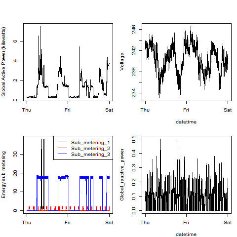

## Introduction

This assignment uses data from
the <a href="http://archive.ics.uci.edu/ml/">UC Irvine Machine
Learning Repository</a>, a popular repository for machine learning
datasets. In particular, we will be using the "Individual household
electric power consumption Data Set" which I have made available on
the course web site:

## Files in the Repository
The repo includes the following files: 

1. README.md : This gives an overview of the project, details how all of the scripts work and how they are connected.
2. plot.R, plot2.R, plot3.R, plot4.R: The scripts with the R Code that is used to plot
3. plot.png, plot2.png, plot3.png, plot4.png:: The png files containing the plots

## The Data Set
* <b>Dataset</b>: <a href="https://d396qusza40orc.cloudfront.net/exdata%2Fdata%2Fhousehold_power_consumption.zip">Electric power consumption</a> [20Mb]

* <b>Description</b>: Measurements of electric power consumption in
one household with a one-minute sampling rate over a period of almost
4 years. Different electrical quantities and some sub-metering values
are available.

The following descriptions of the 9 variables in the dataset are taken
from
the <a href="https://archive.ics.uci.edu/ml/datasets/Individual+household+electric+power+consumption">UCI
web site</a>:

<ol>
<li><b>Date</b>: Date in format dd/mm/yyyy </li>
<li><b>Time</b>: time in format hh:mm:ss </li>
<li><b>Global_active_power</b>: household global minute-averaged active power (in kilowatt) </li>
<li><b>Global_reactive_power</b>: household global minute-averaged reactive power (in kilowatt) </li>
<li><b>Voltage</b>: minute-averaged voltage (in volt) </li>
<li><b>Global_intensity</b>: household global minute-averaged current intensity (in ampere) </li>
<li><b>Sub_metering_1</b>: energy sub-metering No. 1 (in watt-hour of active energy). It corresponds to the kitchen, containing mainly a dishwasher, an oven and a microwave (hot plates are not electric but gas powered). </li>
<li><b>Sub_metering_2</b>: energy sub-metering No. 2 (in watt-hour of active energy). It corresponds to the laundry room, containing a washing-machine, a tumble-drier, a refrigerator and a light. </li>
<li><b>Sub_metering_3</b>: energy sub-metering No. 3 (in watt-hour of active energy). It corresponds to an electric water-heater and an air-conditioner.</li>
</ol>

## Loading the data

When loading the dataset into R, i considered the following:

* The dataset has 2,075,259 rows and 9 columns. First
calculated a rough estimate of how much memory the dataset will require
in memory before reading into R. i Made sure my computer had enough
memory.

* I only used data from the dates 2007-02-01 and
2007-02-02. I read the data from just those dates
rather than reading in the entire dataset and subsetting to those
dates.

* I converted the Date and Time variables to
Date/Time classes in R using the `strptime()` and `as.Date()`
functions.

* I Noted that in this dataset missing values are coded as `?`.

## Making Plots

Our overall goal here is simply to examine how household energy usage
varies over a 2-day period in February, 2007. My task was to
reconstruct the following plots below, all of which were constructed
using the base plotting system.

First i forked and cloned the following GitHub repository:
[https://github.com/rdpeng/ExData_Plotting1](https://github.com/rdpeng/ExData_Plotting1)

For each plot i constructed

* Constructed the plot and saved it to a PNG file with a width of 480
pixels and a height of 480 pixels.

* The Names each of the plot files are `plot1.png`, `plot2.png`, `plot3.png` and `plot4.png`.

* Created a separate R code files (`plot1.R`, `plot2.R`, `plot3.R` and `plot4.R`) that
constructs the corresponding plot, i.e. code in `plot1.R` constructs
the `plot1.png` plot. My code files include code for reading
the data** so that the plots can be fully reproduced. The Code also includes the code that creates the PNG file.

* I then added the PNG file and R code file to my git repository

I then pushed my git repository to
GitHub so that the GitHub version of my repository is up to
date. There are four PNG files and four R code files.

The four plots that were constructed are shown below. 

### Plot 1

 

### Plot 2

 

### Plot 3

 

### Plot 4

 

